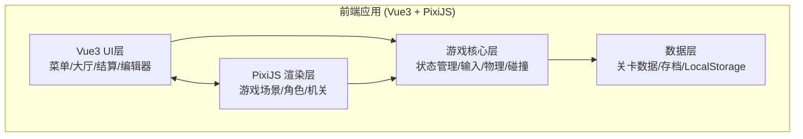
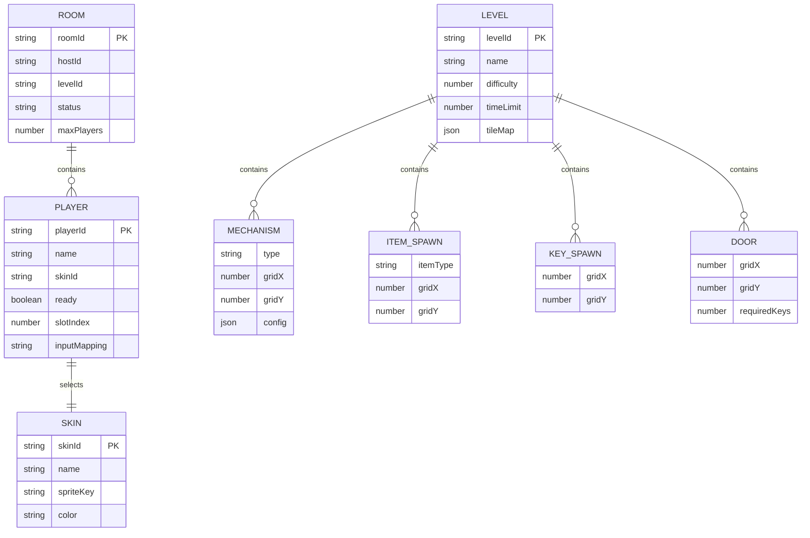

## 1. 架构设计



**分层说明**：
- **Vue3 UI层**：负责所有非游戏画面UI（主界面、房间大厅、结算界面、编辑器面板），通过响应式状态与游戏核心通信
- **PixiJS 渲染层**：负责游戏场景渲染（等距地图、角色精灵、机关动画、特效），挂载在Vue组件内的Canvas上
- **游戏核心层**：纯逻辑层，管理游戏状态、输入映射、碰撞检测、机关逻辑，与渲染解耦
- **数据层**：关卡JSON数据、玩家存档、编辑器导出数据，全部使用LocalStorage持久化

## 2. 技术说明

- **前端框架**：Vue3 + TypeScript + Vite
- **游戏引擎**：PixiJS v8（2D渲染、精灵动画、交互事件）
- **状态管理**：Pinia
- **路由**：Vue Router 4
- **样式方案**：TailwindCSS 3
- **构建工具**：Vite 6
- **后端**：无（纯前端，LocalStorage存储）
- **网络**：无（本地同屏，同一键盘多按键映射）

### 项目目录结构

```
src/
├── assets/              # 静态资源（精灵图、音效配置）
├── components/          # Vue通用组件
│   ├── ui/              # UI组件（按钮、面板、弹窗）
│   └── hud/             # 游戏HUD组件
├── scenes/              # PixiJS场景
│   ├── GameScene.ts     # 游戏主场景
│   └── EditorScene.ts   # 编辑器渲染场景
├── game/                # 游戏核心逻辑
│   ├── core/            # 游戏循环、输入管理、碰撞检测
│   ├── entities/        # 角色、石块、开关等实体
│   ├── mechanisms/      # 四类机关逻辑
│   ├── items/           # 道具逻辑
│   └── map/             # 等距地图、瓦片、寻路
├── stores/              # Pinia状态仓库
│   ├── room.ts          # 房间状态
│   ├── game.ts          # 游戏状态
│   └── editor.ts        # 编辑器状态
├── data/                # 关卡数据、皮肤配置
│   ├── levels/          # 预设关卡JSON
│   └── skins.ts         # 角色皮肤定义
├── views/               # 页面视图
│   ├── HomeView.vue     # 主界面
│   ├── LobbyView.vue    # 房间大厅
│   ├── GameView.vue     # 游戏页面
│   ├── ResultView.vue   # 结算页面
│   └── EditorView.vue   # 关卡编辑器
├── types/               # TypeScript类型定义
├── utils/               # 工具函数
├── App.vue
└── main.ts
```

## 3. 路由定义

| 路由 | 用途 |
|------|------|
| `/` | 主界面 - 游戏标题、创建/加入房间、编辑器入口 |
| `/lobby` | 房间大厅 - 玩家列表、角色选择、关卡选择、准备 |
| `/game` | 游戏场景 - 俯视角45°等距游戏主画面 |
| `/result` | 结算界面 - 星级评价、数据统计 |
| `/editor` | 关卡编辑器 - 可视化地图编辑 |

## 4. 数据模型

### 4.1 数据模型定义



### 4.2 核心TypeScript类型

```typescript
// 等距坐标系
interface IsoPosition {
  gridX: number;
  gridY: number;
  screenX: number;
  screenY: number;
}

// 瓦片类型
type TileType = 'ground' | 'wall' | 'water' | 'bridge' | 'plate' | 'jumpPad' | 'door';

// 机关类型
type MechanismType = 'pushBlock' | 'stepSwitch' | 'timedPlatform' | 'waterTrap';

// 道具类型
type ItemType = 'shield' | 'speedBoost';

// 关卡数据
interface LevelData {
  id: string;
  name: string;
  difficulty: 1 | 2 | 3;
  timeLimit: number; // 秒
  width: number;
  height: number;
  tiles: TileType[][];
  mechanisms: MechanismConfig[];
  items: ItemSpawn[];
  keys: IsoPosition[];
  doors: DoorConfig[];
  starThresholds: { star1: number; star2: number; star3: number };
}

// 角色皮肤
interface SkinData {
  id: string;
  name: string;
  spriteKey: string;
  color: string;
}

// 玩家输入映射
interface InputMapping {
  up: string;
  down: string;
  left: string;
  right: string;
  interact: string;
  useItem: string;
}

// 游戏结果
interface GameResult {
  levelId: string;
  completed: boolean;
  timeUsed: number;
  keysCollected: number;
  totalKeys: number;
  stars: 0 | 1 | 2 | 3;
}
```

## 5. 游戏核心系统设计

### 5.1 等距坐标系统

采用2:1等距投影，菱形网格：
- 网格坐标 (gridX, gridY) → 屏幕坐标转换：screenX = (gridX - gridY) × tileWidth/2, screenY = (gridX + gridY) × tileHeight/2
- 瓦片尺寸：128×64像素（等距菱形）
- 深度排序：按 gridX + gridY 值升序渲染，确保遮挡关系正确

### 5.2 输入管理

本地同屏4人，键位映射：
- **玩家1**：WASD + E(交互) + Q(道具)
- **玩家2**：方向键 + /(交互) + .(道具)
- **玩家3**：IJKL + U(交互) + Y(道具)
- **玩家4**：小键盘8456 + 7(交互) + 9(道具)

### 5.3 碰撞检测

基于网格的AABB碰撞：
- 角色占用1×1网格，移动时检测目标格是否可通行
- 推拉石块检测目标格是否可推入
- 机关触发检测角色是否在对应网格上

### 5.4 机关逻辑

| 机关类型 | 触发条件 | 效果 |
|----------|----------|------|
| 推拉石块 | 角色面向石块按交互键 | 石块沿方向移动一格（不可推入墙/水/其他石块） |
| 踩开关 | 角色/石块站上开关格 | 关联门/桥切换开/关状态 |
| 限时跳板 | 角色踏上 | 倒计时N秒后消失，角色需在时间内通过 |
| 水域陷阱 | 角色踏入水格 | 角色被困/回到最近安全点（有护盾则免疫一次） |

### 5.5 星级评价

基于通关用时：
- ⭐：在限时内通关
- ⭐⭐：用时 ≤ 限时 × 70%
- ⭐⭐⭐：用时 ≤ 限时 × 40%
